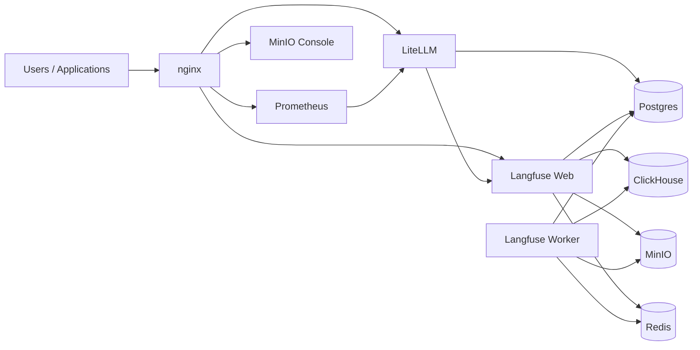

# llm-gateway-stack

[](LICENSE)
[](docker-compose.yml)
[](https://github.com/BerriAI/litellm)
[](https://langfuse.com)

Reference stack for building and operating an LLM gateway with LiteLLM, Langfuse, Postgres, ClickHouse, MinIO, Redis, Prometheus, and an Nginx reverse proxy for path-based UI routing.

This repository provides a production-oriented Docker Compose baseline for teams that need a practical starting point for request routing, observability, and operational control around LLM usage.

**Lead architect:** [Randolph Voorhies](https://github.com/randvoorhies), CTO at [inVia Robotics](https://www.inviarobotics.com).

## Services

- `litellm`: API gateway and model routing
- `langfuse-web`: Langfuse web application and UI
- `langfuse-worker`: Langfuse background worker
- `postgres`: shared database for LiteLLM and Langfuse
- `clickhouse`: Langfuse analytics and event storage
- `migrate-langfuse-events`: one-off ClickHouse schema/backfill job (`migrate` profile)
- `minio`: S3-compatible object storage for Langfuse
- `redis`: cache and coordination backend for Langfuse
- `prometheus`: metrics collection
- `nginx`: reverse proxy and stack gateway (landing page; LiteLLM under `/litellm/`; Langfuse shortcut `/langfuse/` redirects to the published Langfuse port; Prometheus and MinIO console under `/prometheus/` and `/minio/`)

## Architecture



## Quick Start

1. **Create a `.env` file** before running Docker Compose. Compose requires a file named `.env` on disk because `litellm` uses `env_file: .env` (even `docker compose config` fails if it is missing). Typical bootstrap:

   ```bash
   cp .env.example .env
   ./scripts/init_env.py --force
   ```

2. Langfuse bootstrap API keys are generated automatically:
   - `scripts/init_env.py` generates `LANGFUSE_INIT_PROJECT_PUBLIC_KEY` and `LANGFUSE_INIT_PROJECT_SECRET_KEY`.
   - LiteLLM callback keys use the same generated material as the bootstrap project: `.env.example` repeats the `pk-lf-__…__` / `sk-lf-__…__` placeholders on `LANGFUSE_PUBLIC_KEY` / `LANGFUSE_SECRET_KEY`, so `init_env.py` fills them to match `LANGFUSE_INIT_PROJECT_*` (override those keys in `.env` if you rotate or replace them).
   - Keep `LANGFUSE_HOST` as `http://langfuse-web:${LANGFUSE_WEB_INTERNAL_PORT}` for container-to-container traffic (public Hub image; root path).

3. (Optional) adjust bind IPs, ports, and image pins at the top of `.env`.

4. Start (or restart) the stack:

   ```bash
   docker compose up -d
   ```

5. Open:
   - Nginx gateway: `http://localhost/` (port from `NGINX_PORT`, default 80)
   - LiteLLM (gateway link): `http://localhost/litellm/`
   - Langfuse (gateway link): `http://localhost/langfuse/`
   - Prometheus: `http://localhost/prometheus/`
   - MinIO console: `http://localhost/minio/`
   - MinIO API (direct): `http://localhost:9092`

## Pinned images (tested defaults)

Image references are **environment-driven** (`docker-compose.yml` uses `${VAR:-default}`). Defaults in `.env.example` were checked with `docker manifest inspect` on **Sat Mar 28 07:15:31 PM PDT 2026**:

| Service (compose) | Default image | Registry check |
|-------------------|---------------|----------------|
| `litellm` | `docker.litellm.ai/berriai/litellm:main-v1.81.14-stable` | OK |
| `postgres` | `docker.io/library/postgres:17.9` | OK |
| `nginx` | `docker.io/library/nginx:1.27.5-alpine` (`NGINX_IMAGE`) | OK |
| `langfuse-web` | `docker.io/langfuse/langfuse:3.153.0` | OK |
| `langfuse-worker` | `docker.io/langfuse/langfuse-worker:3.153.0` | OK |
| `redis` | `docker.io/library/redis:7.4.7` | OK |
| `clickhouse` | `docker.io/clickhouse/clickhouse-server:22.4` | OK (`22.4`); **`clickhouse/clickhouse-server:22.04` is not a published tag** on Docker Hub |
| `prometheus` | `docker.io/prom/prometheus:v3.9.1` | OK |
| `minio` | `cgr.dev/chainguard/minio:latest` | OK; tag `DEVELOPMENT.2025-10-15T17-29-55Z` returned **MANIFEST_UNKNOWN** when checked |

Override any pin by setting the corresponding `*_IMAGE` variable in `.env`.

The **migrate** job runs `clickhouse-client` from the **same image** as `clickhouse` (`CLICKHOUSE_IMAGE`) so client and server versions stay aligned.

## Common Commands

Start:

```bash
docker compose up -d
```

Stop:

```bash
docker compose down
```

View logs:

```bash
docker compose logs -f --tail=200
```

Validate config (requires `.env` present):

```bash
docker compose config
```

Pull pinned images:

```bash
docker compose pull
```

## Configuration Notes

- Template file for open source use: `.env.example`
- Local file with real secrets: `.env`
- Secret generation script: `scripts/init_env.py`
- Postgres DB/user bootstrap script: `docker/postgres/init/01-create-databases.sh`

LiteLLM is **pulled as a prebuilt image only**. There is no `Dockerfile` or `docker compose build` path for `litellm` in this repository.

Langfuse containers receive `TELEMETRY_ENABLED` from the compose anchor. That value is taken from the **`.env` / shell variable** `LANGFUSE_TELEMETRY_ENABLED` (default `true` in `docker-compose.yml`—see `TELEMETRY_ENABLED: ${LANGFUSE_TELEMETRY_ENABLED:-true}`). Set `LANGFUSE_TELEMETRY_ENABLED=false` in `.env` to disable Langfuse product telemetry. Do **not** rely on a variable named `TELEMETRY_ENABLED` in `.env` for this stack; Compose does not wire that name into Langfuse.

### Bind behavior

- `PUBLIC_BIND_IP` controls externally reachable services.
- `LOCAL_BIND_IP` controls localhost-only services.
- Set `PUBLIC_BIND_IP=127.0.0.1` to keep all public-mapped services local only.
- `NGINX_PORT` controls the reverse proxy listener (`http://localhost:${NGINX_PORT}` by default).

### Shared Postgres and data directory

LiteLLM and Langfuse each get their own database and user in one Postgres instance.

**Data location:** Postgres stores data on the host at `POSTGRES_DATA_HOST_PATH` (default `/var/lib/postgresql/litellm/data`), bind-mounted into the container. This is **intentional** for this deployment: ensure the directory exists and is writable by the Postgres container user (UID/GID per the official `postgres` image, typically `999` or as documented for your pinned image version).

Important: DB/user bootstrap scripts in `/docker-entrypoint-initdb.d` run only when the Postgres data directory is first initialized.

### Database URLs and special characters in passwords

`LITELLM_DATABASE_URL` and `LANGFUSE_DATABASE_URL` in `.env` are built with `${...}` substitution. Passwords that contain URL-reserved characters (`@`, `:`, `/`, `?`, `#`, etc.) **must** be percent-encoded in the URL, or you should use passwords that are safe for URL userinfo. Otherwise connections from LiteLLM/Langfuse can fail in non-obvious ways.

### Langfuse API Keys For LiteLLM Callbacks

Default behavior:

- `scripts/init_env.py` generates bootstrap project keys.
- `LANGFUSE_PUBLIC_KEY` / `LANGFUSE_SECRET_KEY` use the same `init_env.py` placeholders as `LANGFUSE_INIT_PROJECT_*`, so they match after generation.

Optional override:

- You can still create additional keys in the Langfuse UI and set them manually if needed.

Notes:

- LiteLLM uses `LANGFUSE_HOST` (internal URL): `http://langfuse-web:3000`
- For humans or SDKs, use `http://localhost:${LANGFUSE_WEB_PORT}` (the gateway path `/langfuse/` is a redirect to that URL when using the public image)

## Known Issues & Automated Fixes

### Langfuse v3 ClickHouse `events` table bug

Recent Langfuse v3 releases depend on a new `events` table (and related structures) for the v2 Metrics API. Official database migrations for self-hosted instances have not been shipped yet, which can cause the Langfuse Web UI to return **500 Internal Server Errors** with `Unknown table expression identifier 'events'` when metrics or related queries run. This is tracked upstream in:

- [langfuse/langfuse#11924](https://github.com/langfuse/langfuse/issues/11924)
- [langfuse/langfuse#11248](https://github.com/langfuse/langfuse/issues/11248)

**DDL maintenance:** The workaround DDL in [docker/clickhouse/01-langfuse-ddl.sql](docker/clickhouse/01-langfuse-ddl.sql) mirrors upstream-shaped schema. When Langfuse ships official migrations, **diff** that DDL against this file and remove or replace what upstream covers to avoid drift and conflicts.

**First line of defence (new installs):** The DDL script is mounted into the ClickHouse container at `/docker-entrypoint-initdb.d/`. The [official ClickHouse image](https://hub.docker.com/_/clickhouse#how-to-extend-this-image) runs `*.sql` there on first initialization (when the data directory is empty). **Brand-new installs** get the required `observations_batch_staging` and `events` tables automatically; backfill is not run at init (Langfuse will populate data going forward).

**Existing installs:** Init scripts run only on first init, so an existing ClickHouse volume will not re-run the DDL. To create tables and backfill from existing `observations`/`traces` once:

```bash
docker compose --profile migrate run --rm migrate-langfuse-events
```

**Migrate semantics (“idempotent”):** `CREATE TABLE IF NOT EXISTS` in the DDL is idempotent. The backfill is plain `INSERT INTO events SELECT ...`. Re-running inserts **additional rows**; `ReplacingMergeTree` may deduplicate over time depending on keys and merges, but you should **not** assume immediate deduplication or that re-runs are free of duplicate logical events. Prefer running the migrate **once** after backup, unless you understand the merge behavior for your data.

The migrate service uses `CLICKHOUSE_IMAGE` (same as the `clickhouse` service) and is only active with `--profile migrate`.

## Prometheus and LiteLLM metrics

[prometheus.yml](prometheus.yml) includes a `litellm` scrape target on port **4000**. Whether LiteLLM exposes Prometheus metrics on that port, and at which **path** (for example `/metrics`), depends on the LiteLLM version and configuration. **This repository does not yet verify** that scrape against the pinned image; treat Prometheus as **best-effort** until you confirm with LiteLLM docs or by probing the running container.

## Security Notes

- Never commit `.env` with real secrets; commit `.env.example` only (see `.gitignore`).
- Default `PUBLIC_BIND_IP=0.0.0.0` in `.env.example` exposes LiteLLM, Langfuse web, the nginx gateway, Prometheus, and MinIO API on all interfaces if the host firewall allows it. Restrict inbound rules and use `127.0.0.1` when the stack should be local-only.
- Optional Langfuse bootstrap credentials in env (`LANGFUSE_INIT_USER_PASSWORD`, etc.) are convenient for first run; **rotate or clear** them after bootstrap in sensitive environments.
- Redis uses `requirepass`; the healthcheck passes the password to `redis-cli`. This is normal for Redis; keep `REDIS_AUTH` secret.
- For production, rotate any secret that may have been exposed and follow [SECURITY.md](SECURITY.md) for reporting issues.

### Upstream LiteLLM supply-chain notice

LiteLLM experienced a public supply-chain compromise in PyPI releases `1.82.7` and `1.82.8` in March 2026. This repository does **not** use those affected PyPI releases by default; it pulls a prebuilt container image pinned in `.env.example`. If you override the LiteLLM image pin or consume LiteLLM separately, verify provenance carefully and avoid the affected package versions.

See [SECURITY-NOTICE.md](SECURITY-NOTICE.md) for the short disclosure note and references.

## Open Source Distribution Tip

For public repos, recommend users do:

```bash
cp .env.example .env
./scripts/init_env.py --force
docker compose up -d
```

Bootstrap Langfuse API keys and LiteLLM callback wiring are generated by `init_env.py`. Open the gateway at `http://localhost/` (see `NGINX_PORT`). If you override keys in `.env`, run `docker compose restart litellm` (or `docker compose up -d`) so LiteLLM picks them up.

## Contributing & agents

- [CONTRIBUTING.md](CONTRIBUTING.md)
- [AGENTS.md](AGENTS.md) (guidance for AI coding agents; `CLAUDE.md` in this repo is a symlink to the same file)
- [CODE_OF_CONDUCT.md](CODE_OF_CONDUCT.md)
- [LLM-DISCLOSURE.md](LLM-DISCLOSURE.md)
